# Assignment 1 Answers

## Section 1

### Q1.2

Provide a table that compares the 10-most cosine-similar words to the word ‘dog’, in order, alongside to the 10 closest words computed using euclidean distance. 

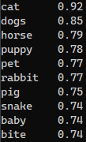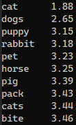

(Left: CosSim Right: ED)

Give the same kind of table for the word ‘computer.’ 

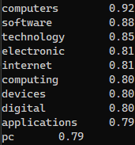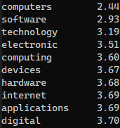

Does one of the metrics (cosine similarity or euclidean distance) seem to be better than the other? 

No. The result above does not provide enough evidence of one metric better than the other.

1. From the result we can see that there is very slight difference between the 10-most similar words calculated by different metrics.
2. Each words in the list certainly seems to match the requirement to be similar to the original word.
3. The gap between numerical scores are slightly bigger using ED than using CosSim. But I don't think this make ED a more accurate metric. Because using ED you get score in $[0, +\infin)$ while using CosSim you get $[-1, 1]$

### Q1.3 

In `A1P1_4.py`, I choose to convert cities to their countries. The result is as the following table shows.

| Cities  |                            Result                            |   Cities   |                            Result                            |
| :-----: | :----------------------------------------------------------: | :--------: | :----------------------------------------------------------: |
| Beijing | 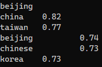 |   Athens   | 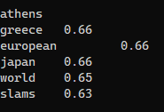 |
|  Tokyo  | 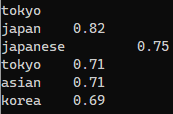 |   Ottawa   | 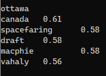 |
|  Seoul  | 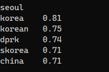 | Leningrad  | 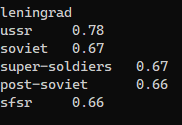 |
| London  | 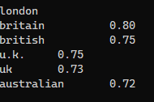 | Washington | 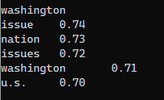 |
|  Paris  | 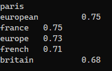 |   Riyadh   | 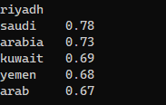 |

The pattern $athens - city + nation = greece$ is very precise to most of the city in the list while using CosSim. We can confirm that the quality of the result is better than expected: it gives "USSR" for "Leningrad". However, there are some anomalies. For "Washington", "U.S." is on the 5th place in the list. I think the reason is the other meanings of it weight more than "Washington D.C."

### Q1.4

I think this may support that vectors have bias in ethics of origin, but the evidence is not very strong. As I haven't found any article mentioning this.

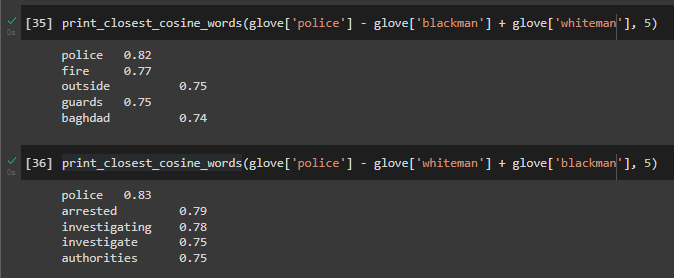

### Q1.5

How does the Euclidean difference change between the various words in the notebook when switching from d=50 to d=300? 

The Euclidean difference grows larger as the dimension grows.

How does the cosine similarity change? 

The cosine similarity grows smaller as the dimension grows.

Does the ordering of nearness change? 

It changes a little bit. Some word remain in the list but some not.

Is it clear that the larger size vectors give better results - why or why not?

Yes. In my opinion, the larger size of vectors will guarantee more dimensions to measure the difference between words, which means more precisely the words are mapped into the latent codes.

### Q1.6

State any changes that you see in the Bias section of the notebook.

The words in bias section does not show as much bias as it is when dim=50. For example, $programmer \mp man \pm woman$ will be still programmer this time.

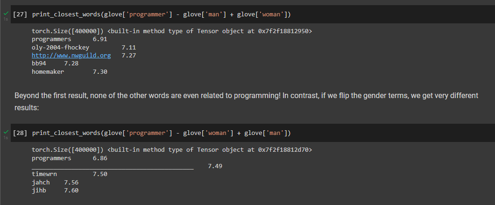

## Section 2

### Q2.2

 Compute the similarity:

| word       | method(a) | method(b) |
| ---------- | --------- | --------- |
| greenhouse | 0.0766    | 0.0949    |
| sky        | 0.3658    | 0.4601    |
| grass      | 0.2570    | 0.3221    |
| purple     | 0.5669    | 0.7124    |
| scissors   | 0.0942    | 0.1186    |
| microphone | 0.0736    | 0.0925    |
| president  | 0.0469    | 0.0588    |

Do the results for each method make sense? Why or why not? 

Yes. The results show that "sky" and "grass" have more color than the other words while "purple" have the most, which match the description in the section.

What is the apparent difference between method 1 and 2?

* From the results, method 2 tend to give a higher cosine similarity result than method 1.

* From the algorithm, method 2 average the embedded colors first, then calculate the similarity of the averaged colors to the given word. And the averaged colors could actually represent none of the colors in the category rather than being a general embedded concept of the category. 

### Q2.3

Build-up words of the *temperature* category: molten, hot, warm, cold, celcius, freeze.

Results:

| word       | method1 | method2 |
| ---------- | ------- | ------- |
| sun        | 0.2579  | 0.3245  |
| snow       | 0.01976 | 0.2486  |
| ice        | 0.1741  | 0.2194  |
| winter     | 0.2187  | 0.2752  |
| warm       | 0.2341  | 0.2942  |
| fun        | 0.1366  | 0.1711  |
| news       | 0.0749  | 0.0945  |
| programmer | -0.0211 | -0.0268 |
| pc         | 0.0506  | 0.0634  |
| president  | 0.0469  | 0.0588  |

The results shows the ability of the category to recognize the word with some specific "temperature" inside, e.g. snow, winter, etc. The results are not as clear as the color table. Because when talking temperature, the word in the category are too linear and somehow lacks diversity. If a word have high cosine similarity with "warm", then it should somehow have low similarity with "cold". Then the averages with method 1 are a little bit ambiguous.

### Q2.4

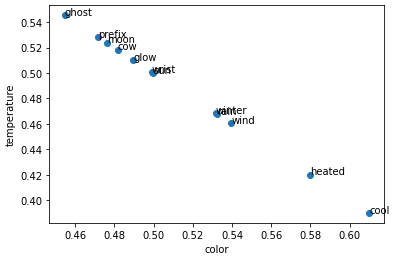

Do the words that are similar end up being plotted close together? Why or why not?

Yes. 'sun' and 'moon' are close to each other though there are 'glow', ' cow' in between them. 'winter', 'wind', 'rain' are closed to each other. 'heated', 'cool' are closed to each other. This is mainly because in the tradeoff between color and temperature, those words have similar portions.

## Section 3

### Q3.1

three pairs of words that this corpora implies have similar or related meanings.

* rub - hold
* a - the
* cat - dog

### Q3.2

Which is the most frequent word in the corpus, and the least frequent word? 

* 'and', with the frequency of 160
* 'I', with the frequency of 80

What purpose do the v2i and i2v functions serve?

They are the dictionaries that converts vectors to indices (v2i) and reverts (i2v).

### Q3.3

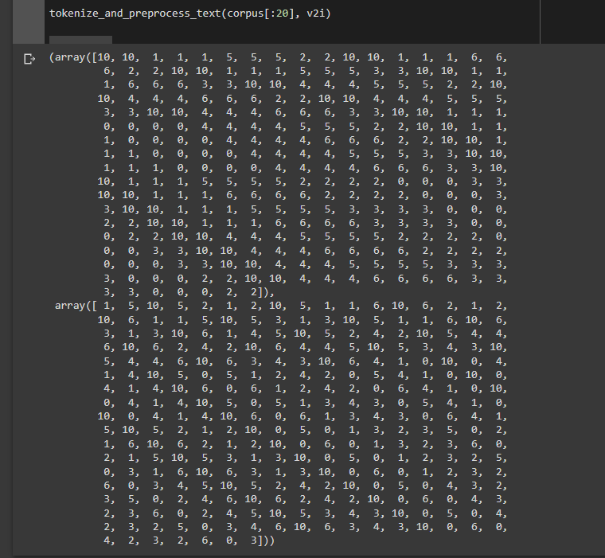

My function converts the text list and outputs the center word and context in the window separately.

### Q3.4

What is the total number of parameters in this model with an embedding size of 2 - counting all the weights and biases?

$n_{params}=V\times E\times 2 = 11\times2\times2=44$ . V is the vocabulary size, E is the embedding size. Multiple by 2 since there are 2 layers which have the same shape.

### Q3.5

learning rate = 4e-3

Training and Validation Curve:

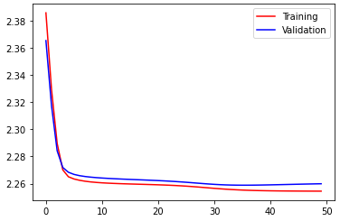

apparent success (or lack thereof) that these curves suggest:

There might be a slight portion of underfitting, as the validation loss is always higher than training loss when they come to their convergence.

### Q3.6

For your best learning rate, display each of the embeddings in a 2-dimensional plot using Matplotlib.

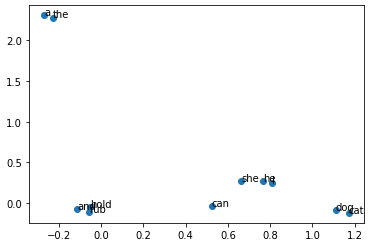

Do the results make sense, and confirm your choices from part 1 of this Section? 

Yes. The result shows exactly the pair of 'a' - 'the', 'hold' - 'rub', 'she' - 'he' and 'dog' - 'cat'.

What would happen when the window size is too large? 

When the window size is too large, more generalization will be added to the model, and each word are paired with almost all other words in the sentences, causing the reduction of the model's performance.

At what value would window become too large for this corpus?

Window larger than 5.

## Section 4

### Q4.1

Give a 3 sentence summary of the subject of the document.

The history of coin production in America. The history of the coin in the ancient world. The process and economical data of the Mints in America.0

### Q4.2

What are the functional differences between this code and that of the same function in Section 3?

It takes more complicated inputs that has many symbols and numbers to process. After the vocabulary is created, the function also filter the words not included in vocabulary by assigning them "\<oov>".

### Q4.3

the number of words in the text:

69267 words

the size of the filtered vocabulary:

7359 different words, with total presence 62015 times

the most frequent 20 words in the filtered vocabulary

('the', 5047), ('of', 3438), ('be', 2283), ('and', 1943), ('in', 1588), ('to', 1379), ('a', 1226), ('for', 531), ('as', 518), ('by', 493), ('he', 483), ('with', 471), ('coin', 417), ('this', 387), ('on', 377), ('his', 368), ('which', 346), ('at', 334), ('it', 332), ('from', 326)

Of those top 20 most frequent words, which one(s) are unique to the subject of this particular text?

'coin'

### Q4.4

How many total examples were created?

453632 examples.

### Q4.7

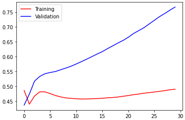

I can't say the training was good, but it seems that the model works well in Q4.8.

### Q4.8

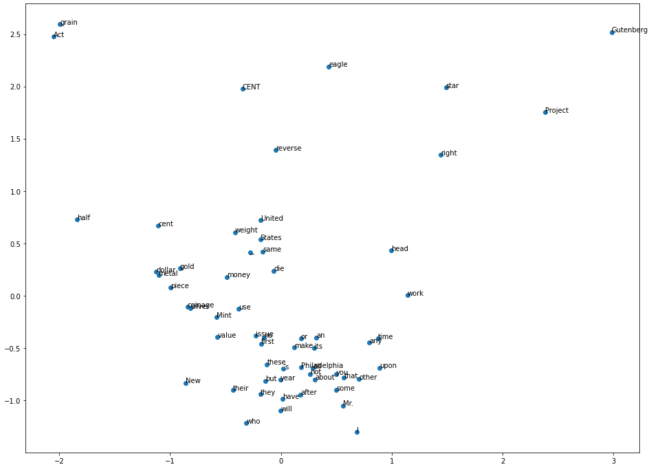

The embedding certainly seemed to work good. 'United' is plotted very closed to 'States'. 'dollar', 'gold', 'metal' are close to each other. However, it is confusing that 'Act' and 'grain' are plotted together far from all the other words.