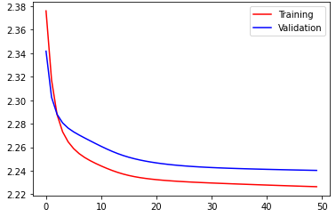

# Assignment 1 Answers

## Section 1

### Q1.2

Provide a table that compares the 10-most cosine-similar words to the word ‘dog’, in order, alongside to the 10 closest words computed using euclidean distance. 

(Left: CosSim Right: ED)

Give the same kind of table for the word ‘computer.’ 

Does one of the metrics (cosine similarity or euclidean distance) seem to be better than the other? 

No. The result above does not provide enough evidence of one metric better than the other.

1. From the result we can see that there is very slight difference between the 10-most similar words calculated by different metrics.
2. Each words in the list certainly seems to match the requirement to be similar to the original word.
3. The gap between numerical scores are slightly bigger using ED than using CosSim. But I don't think this make ED a more accurate metric. Because using ED you get score in $[0, +\infin)$ while using CosSim you get $[-1, 1]$

### Q1.3 

In `A1P1_4.py`, I choose to convert cities to their countries. The result is as the following table shows.

| Cities  |                            Result                            |   Cities   |                            Result                            |
| :-----: | :----------------------------------------------------------: | :--------: | :----------------------------------------------------------: |
| Beijing |  |   Athens   |  |
|  Tokyo  |  |   Ottawa   |  |
|  Seoul  |  | Leningrad  |  |
| London  |  | Washington |  |
|  Paris  |  |   Riyadh   |  |

The pattern $athens - city + nation = greece$ is very precise to most of the city in the list while using CosSim. We can confirm that the quality of the result is better than expected: it gives "USSR" for "Leningrad". However, there are some anomalies. For "Washington", "U.S." is on the 5th place in the list. I think the reason is the other meanings of it weight more than "Washington D.C."

### Q1.4

I think this may support that vectors have bias in ethics of origin, but the evidence is not very strong. As I haven't found any article mentioning this.

### Q1.5

How does the Euclidean difference change between the various words in the notebook when switching from d=50 to d=300? 

The Euclidean difference grows larger as the dimension grows.

How does the cosine similarity change? 

The cosine similarity grows smaller as the dimension grows.

Does the ordering of nearness change? 

It changes a little bit. Some word remain in the list but some not.

Is it clear that the larger size vectors give better results - why or why not?

Yes. In my opinion, the larger size of vectors will guarantee more dimensions to measure the difference between words, which means more precisely the words are mapped into the latent codes.

### Q1.6

State any changes that you see in the Bias section of the notebook.

The words in bias section does not show as much bias as it is when dim=50. For example, $programmer \mp man \pm woman$ will be still programmer this time.

## Section 2

## Section 3

### Q3.1

three pairs of words that this corpora implies have similar or related meanings.

* rub - hold
* a - the
* cat - dog

### Q3.2

Which is the most frequent word in the corpus, and the least frequent word? 

* 'and', with the frequency of 160
* 'I', with the frequency of 80

What purpose do the v2i and i2v functions serve?

They are the dictionaries that converts vectors to indices (v2i) and reverts (i2v).

### Q3.3

My function converts the text list and outputs the center word and context in the window separately.

### Q3.4

What is the total number of parameters in this model with an embedding size of 2 - counting all the weights and biases?

$n_{params}=V\times E\times 2 = 11\times2\times2=44$ . V is the vocabulary size, E is the embedding size. Multiple by 2 since there are 2 layers which have the same shape.

### Q3.5

learning rate = 0.002

Training and Validation Curve:

apparent success (or lack thereof) that these curves suggest:

There might be a slight portion of underfitting, as the validation loss is always higher than training loss when they come to their convergence.

### Q3.6

Do the results make sense, and confirm your choices from part 1 of this Section? 

What would happen when the window size is too large? 

At what value would window become too large for this corpus?

### Q3.7

Run the training sequence twice - and observe whether the results are identical or not.

They are not, so we need to use seeds to provide more stable training for comparison.

## Section 4

### Q4.1

Give a 3 sentence summary of the subject of the document.

The history of coin production in America. The history of the coin in the ancient world. The process and economical data of the Mints in America.0

### Q4.2

