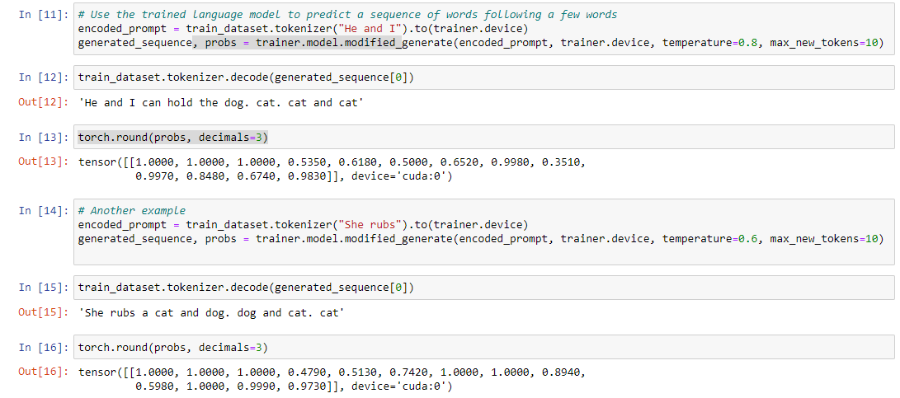

# ECE1786H Assignment 3 Report

*Haocheng Wei (1008498261)*


## Section 1. Karpathy’s minGPT

### 1.2 Questions

**Question 1.2.1** Which class does `LanguageModelingDataset` inherit from? (1 point) 

**Answer:** The `Dataset` class from`torch.utils.data`.

**Question 1.2.2** What does the function `lm_collate_fn` do? Explain the structure of the data that results when it is called. (2 points) 

**Answer:** The function takes a batch of sentences (indices) as input and perform padding on them to make them same length. When calling this function, it returns a batch of data with ones padding to the max length among this batch. The shape of `padded_x` will be `(batch_size, maxlen)`

**Question 1.2.3** Looking the notebook block [6], (with comment “Print out an example of the data”) what does this tell you about the relationship between the input (X) and output (Y) that is sent the model for training? (1 point) 

**Answer:** X and Y are basically the same sentence. While the subject of the sentence in Y is removed, and punctuation in X is removed.

**Question 1.2.4** Given one such `X,Y` pair, how many different training examples does it produce? (1 point) 

**Answer:** Total examples for 1 pair of X, Y will be `len(x) - 1`, which is 3 in the case in Q1.2.3

**Question 1.2.5** In the generate function in `model.py` what is the default method for how the generated word is chosen? (1 point) 

**Answer:** In default method, which is `do_sample=False`, the indices are sampled from the multinomial probability distribution located in the corresponding row of output probabilities using `torch.multinomial` method.

**Question 1.2.6** What are the two kinds of heads that `model.py` can put on to the transformer model? Show (reproduce) all the lines of code that implement this functionality and indicate which method(s) they come from. (2 points) 

**Answer:** Language modeling head and Classification head in the `__init__()` method of class `GPT()`

```python
        self.lm_head = nn.Linear(config.n_embd, config.vocab_size, bias=False)
        self.classifier_head = nn.Linear(config.n_embd, config.n_classification_class, bias=True)
```

**Question 1.2.7** How are the word embeddings initialized prior to training? (1 point) 

**Answer:** in class `GPT(nn.Module)`, by calling function `_init_weights(*self*, *module*)`, the embedding layers are initialized with mean weight = 0.0 and standard deviation = 0.02.

```python
torch.nn.init.normal_(module.weight, mean=0.0, std=0.02)
```

**Question 1.2.8** What is the name of the object that contains the positional embeddings? (1 point) 

**Answer:** `GPT.transformer.wpe`, which is a pytorch Embedding layer.

**Question 1.2.9** How are the positional embeddings initialized prior to training? (1 point) 

**Answer:** same as word embedding, while the embedding layer different in sizes.

**Question 1.2.10** Which module and method implement the skip connections in the transformer block? Give the line(s) of code that implement this code. (1 point)

**Answer:** method `forward(x)` in module `Block(nn.module)` as the following lines shows:

```python
    def forward(self, x):
        x = x + self.attn(self.ln_1(x))
        x = x + self.mlpf(self.ln_2(x))
        return x
```


## Section 2. Training and using a language model on a Small Corpus 

**Question 2.1** Report the value of the loss. (1 point) 

```
iter_dt 0.00ms; iter 0: train loss 10.81249
iter_dt 19.00ms; iter 100: train loss 5.96995
iter_dt 25.00ms; iter 200: train loss 2.49559
iter_dt 19.00ms; iter 300: train loss 1.49280
iter_dt 18.00ms; iter 400: train loss 0.83902
iter_dt 18.00ms; iter 500: train loss 0.78918
iter_dt 19.00ms; iter 600: train loss 0.83952
iter_dt 19.00ms; iter 700: train loss 0.70429
iter_dt 18.00ms; iter 800: train loss 0.64494
iter_dt 20.01ms; iter 900: train loss 0.59071
iter_dt 20.00ms; iter 1000: train loss 0.56029
iter_dt 19.00ms; iter 1100: train loss 0.76987
iter_dt 17.95ms; iter 1200: train loss 0.58646
iter_dt 18.00ms; iter 1300: train loss 0.61791
iter_dt 18.00ms; iter 1400: train loss 0.66156
iter_dt 19.00ms; iter 1500: train loss 0.68874
iter_dt 21.00ms; iter 1600: train loss 0.69681
iter_dt 21.00ms; iter 1700: train loss 0.62078
iter_dt 18.00ms; iter 1800: train loss 0.58298
iter_dt 17.99ms; iter 1900: train loss 0.59302
iter_dt 17.53ms; iter 2000: train loss 0.59085
iter_dt 19.00ms; iter 2100: train loss 0.60756
iter_dt 18.00ms; iter 2200: train loss 0.64772
iter_dt 17.97ms; iter 2300: train loss 0.57708
iter_dt 19.00ms; iter 2400: train loss 0.62975
iter_dt 20.00ms; iter 2500: train loss 0.65382
iter_dt 18.00ms; iter 2600: train loss 0.64882
iter_dt 20.90ms; iter 2700: train loss 0.76117
iter_dt 18.00ms; iter 2800: train loss 0.63148
iter_dt 18.01ms; iter 2900: train loss 0.68538
```

**Question 2.2** Run the two code snippets following the training that calls the generate function. What is the output for each? Why does the the latter parts of the generation not make sense? (2 point) 

Output for the first:

```
'He and I hold the dog.. cat. cat and dog'
```

Output for the second:

```
'She rubs a cat and dog. cat. cat. cat'
```

I think the reason is that when the generated tokens are already the end of a sentence and there still some words to reach max length, so the model keep providing the most common last few words of a sentence.

**Question 2.3** Modify the generate function so that it outputs the probability of each generated word. Show the output along with these probabilities for the two examples, and then one of your own choosing. (1 point) 

Output and possibilities of the two examples:



One of my own choosing:


**Question 2.4** Modify the generate function, again, so that it outputs, along with each word, the words that were the 6-most probable (the 6 highest probabilities) at each word output. Show the result in a table that gives all six words, along with their probabilities, in each column of the table. The number of columns in the table is the total number of generated words. For the first two words generated, explain if the probabilities in the table make sense, give the input corpus. (5 points) 

Input corpus: `"He and I"`: make sense. The first word in column 0 has 3 choices, all of which are verbs, and the second word has choices between `the` and `a` , which are article words.


Input corpus: `"She rubs"`: make sense. The first word in column 0 has choices among 2 article words and `and`, and the second word has choices between `cat` and `dog` , which are following the article words.


## Section 3. Training on the Bigger Corpus and Fine-Tuning Classification [8 points]

**Question 3.1** Report which of these two methods you used - trained yourself, or loaded the saved model.

I trained the model myself. While using `train_config.batch_size = 16` I unfortunately got 

```
RuntimeError: CUDA out of memory.
```

So I changed the batch size slightly smaller to `train_config.batch_size = 8`.

**Question 3.2** Report the examples you used and the generation results, and comment on the quality of the sentences.

Input: `It is`

Generated sentence: `It is said that he also connected and the one of the`

Comment: seems that there are some grammar errors in the second half of the sentence.

Input: `It may be`

Generated sentence: `It may be seen that one side is the eagle, the date`

Comment: the generated sentence tends to describe the details of a coin.

Input: `Having refered to`

Generated sentence:`Having refered to these, but so many years, especially one hundred`

Comment: the generated sentence said something, but said nothing. Maybe the desired sentence is too long compared to max length.

**Question 3.3**

Using the first 1200 samples from the train split, the curves are as follows: (The yellow lines are the running average, as the noise is pretty large due to small batch size)


Actually this is slightly overfitted according to the curves. So I used all the train split and validation split as the dataset, then re-trained the model, and I found that the curves are far more better even before we fine tune the model.


